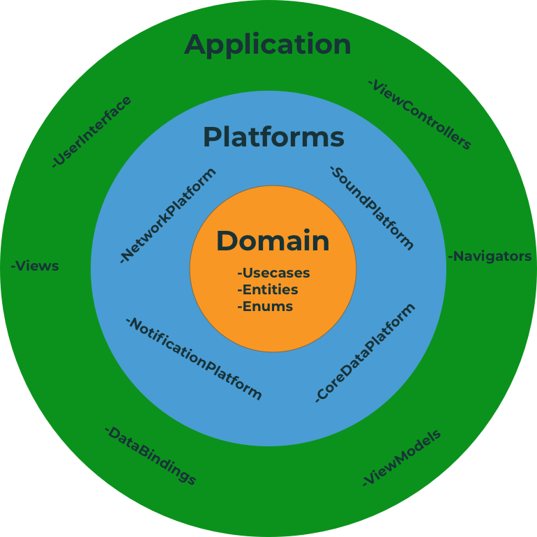

# Clean Architecture Starter for iOS Application

## High level overview

## File Directory

#### Domain 

The `Domain` is basically what is the App about and what it can do (Entities, UseCase etc.) **It does not depend on UIKit or any persistence framework**, and it doesn't have implementations apart from entities
Domain contains Protocols of eatch platform so there is no dependency between the platforms and they can work with eachother through the protocols.

#### Platform
The `Platform` is a concrete implementation of the `Domain` in a specific platform like iOS. It does hide all implementation details.

#### Application
`Application` is responsible for delivering information to the user and handling user input. It can be implemented with any delivery pattern e.g (in Playor is MVVMC). This is the place for `UIView`s and `UIViewController`s. As you will see from the app, `ViewControllers` are completely independent of the `Platform`.  The only responsibility of a view controller is to "bind" the UI to the Domain to make things happen.

## Next steps

Would you like decide what will be the next feature?

* [ ] Add NetworkPlatform.
* [ ] Add CoreDataPlatform.
* [ ] Complete SSTools.
* [ ] Create Data Layer for Interactor Implementations.
* [ ] Create a Tutorial on how VIPER Works and how to Implement it in a real-life project.

## References
- [Clean Swift](https://clean-swift.com)
- [iOS Architecture Patterns](https://medium.com/ios-os-x-development/ios-architecture-patterns-ecba4c38de52#.ba7q8dcih)

## Contributed
This is an open source project, so feel free to contribute.
- Open an [issue](https://github.com/Salarsoleimani/CleanStarter/issues/new).

----

> This idea came because whenever I had to create a new project, It took me a long time to put the initiating things together. Hope you guys enjoy it, Thank you :heart:.

## Author

#### | ["Follow @salarsoleimani Twitter"](http://twitter.com/salarsoleimani) |
#### | ["Email me"](mailto:s.s_m1983@yahoo.com) |
